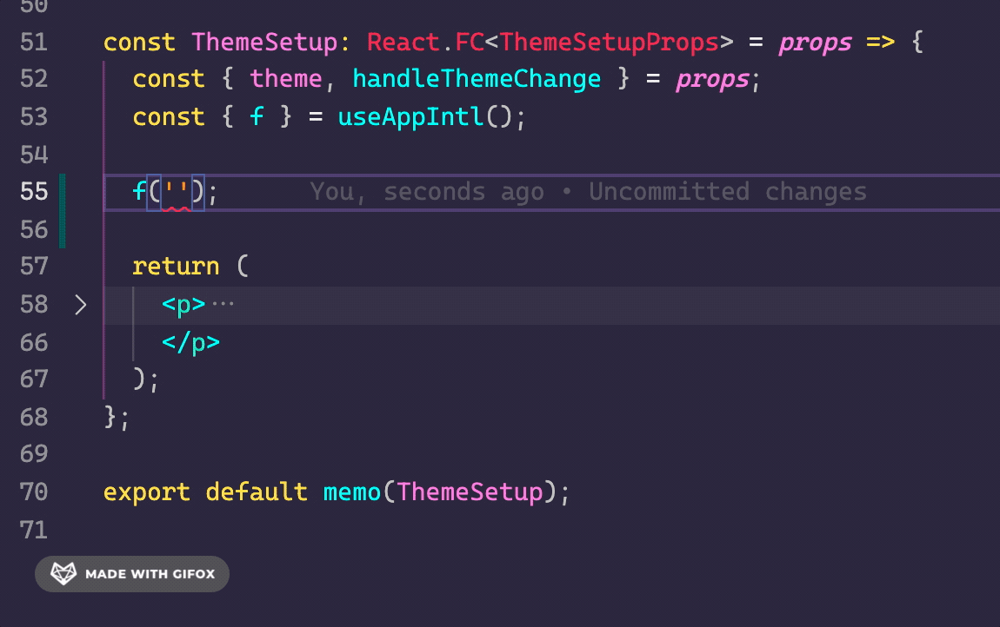
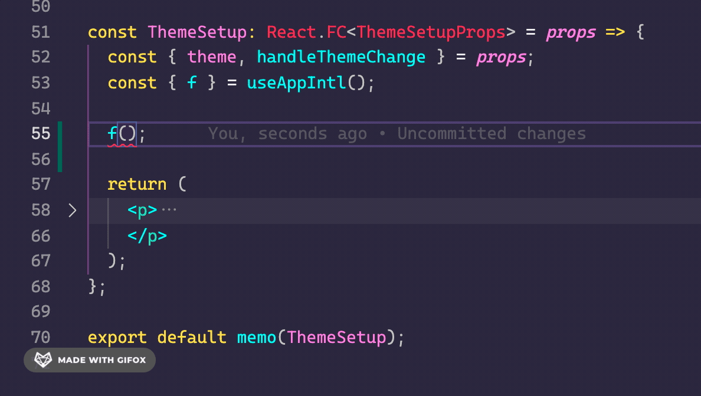

> 基于 `react-intl` 实现，具体请阅核心代码与[官方文档](https://formatjs.io/docs/react-intl/)

```sh title="locales目录结构如下"
├── modules                 # 各语言模块
├── rootLocales             # 应用的语言模块集合 与 AntD UI库中多个语言的集合
└── index.ts                # 核心方法的出口处
```

## 语言模块的定义

例如 system 语言模块：

```ts title="locales/"
/**
 * @description App相关的文案配置
 * 索引 0 -> 简体中文， 1 -> 繁体， 2 -> 英文
 */

export default {
  页面加载异常: ['页面加载异常', '頁面加載異常', 'Page loading exception'],
  去登录: ['去登录', '去登錄', 'Go to login'],
  返回首页: ['返回首页', '返回首頁', 'Back home'],
  个人中心: ['个人中心', '個人中心', 'Profile'],
  退出登录: ['退出登录', '退出登錄', 'Log out'],
  关闭其他: ['关闭其他', '關閉其他', 'Close other'],
  关闭所有: ['关闭所有', '關閉所有', 'Close all'],
  主题色: ['主题色', '主題色', 'Theme color'],
  刷新: ['刷新', '刷新', 'Refresh'],
  关闭: ['关闭', '關閉', 'Close'],
  登录: ['登录', '登錄', 'Login'],
  设置: ['设置', '設置', 'Setting'],
  确定: ['确定', '確定', 'Confirm'],
  取消: ['取消', '取消', 'Cancel'],
  返回: ['返回', '返回', 'Go back']
} as const;
```

- 遵循不同索引对应不同语言的方式
- `as const` 是 `TS` 中  的 [`常量断言`](https://www.typescriptlang.org/docs/handbook/release-notes/typescript-3-4.html#const-assertions)，是为了在使用国际化插件时有 具体的 key 提示。**(后面会有例子展示)**

## API 的使用

### useAppIntl

> `useAppIntl` 是 `index.ts` 内基于 `useIntl` 封装的一个钩子，为提升开发时的 TS 体验。

```tsx
import { useAppIntl } from '@/locales';

const ThemeSetup: React.FC = () => {
  const { f } = useAppIntl();

  return <p>{f('主题色')}</p>;
};
```

调用`useAppIntl` 钩子解构出的 `f` 实则为 `react-intl` 的 `formatMessage`，特此简写以及做了一层完善 `TS` 提示的封装。

`f` 分别有两个参数：

- 第一个参数为 key (string)，也就是我们在 `语言模块` 里导出的对象中的 key。 **(必填)**
- 第二个参数为 values (Record<占位符名称, 要填充的值>)。主要用于填充 key 中的占位符。 **(选填)**

通过下图，让我们看看封装后带来的 `TS` 体验。



可以从动图中看出，第一个参数 key，必须为 `语言模块` 中存在的 key，否则会 _异常_ 警告。

再让我们通过下图看看第二个参数又有何不错的 `TS` 体验。



^\_^，没错，第二个填充占位符的对象参数，可以根据第一个参数 key 中的值而推导出含有哪些占位符名称。

如若在对象参数内没有填写推导出的占位符对应的值，则也 _异常_ 警告。

### getAppIntl

> `getAppIntl` 主要用处与 `useAppIntl` 一样，但它并非钩子，可以在非组件的环境下使用。
