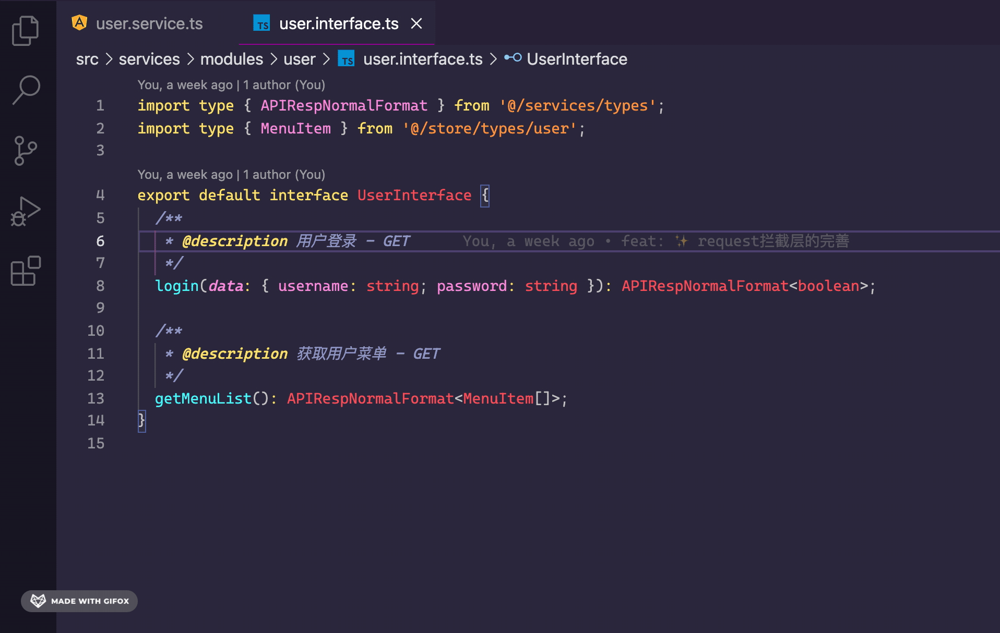
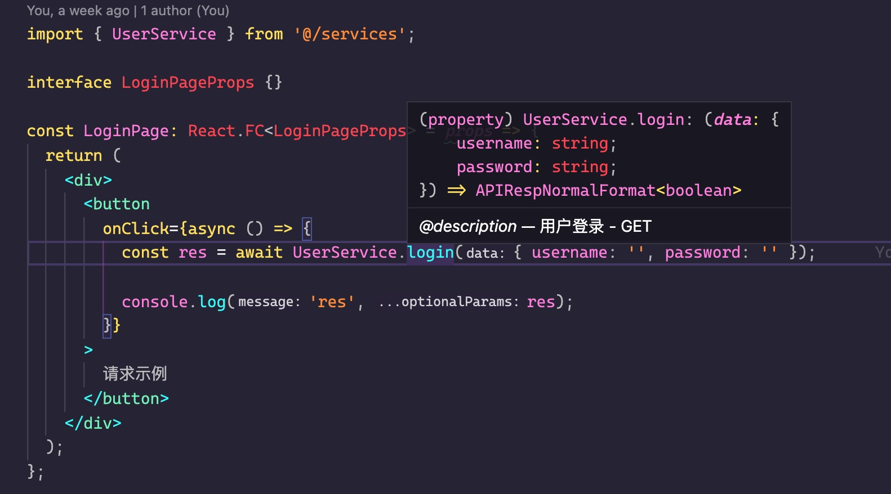

项目中的请求统一放置 /src/services/ 中。

```sh title="servicers目录结构如下"
├── modules                 # 各接口模块
├── uitls                   # 放着与请求相关的工具函数 (例如: request 的封装)
└── index.ts                # 控制各接口模块的出口
```

## 接口模块

> 接口模块统一以 [`interface`](#interface-接口层)、[`service`](#service-实现层)、`type` 这三层进行规范开发。

例如 user 接口模块：

```sh
servicers
├── modules
│   ├── user
│   │   ├── user.interface.ts
│   │   ├── user.service.ts
└── └── └── user.type.ts
```

### interface 接口层

> 主要用于定义此模块拥有哪些接口，以及这些接口的请求类型、返回类型和注释。

例：

```ts
import type { APIRespNormalFormat } from "@/services/types";
import type { MenuItem } from "@/store/types/user";

export default interface UserInterface {
  /**
   * @description 用户登录 - GET
   */
  login(data: {
    username: string;
    password: string;
  }): APIRespNormalFormat<boolean>;

  /**
   * @description 获取用户菜单 - GET
   */
  getMenuList(): APIRespNormalFormat<MenuItem[]>;
}
```

你可能疑惑为什么要大费周章起一个 `interface` 层。

实际上是可以通过它与 [`service`](#service-实现层) 实现层配合打出一套开发体验不错的组合拳。

具体体验不错在哪，在接下来的介绍会为你揭晓。

### service 实现层

> 主要用于实现 [`interface`](#interface-接口层) 中定义的各接口。

例：

```ts
import BaseService from "../base.service";
import type UserInterface from "./user.interface";

const serviceModuleName = "/user";

class UserService extends BaseService implements UserInterface {
  constructor() {
    super(serviceModuleName);
  }

  getMenuList: UserInterface["getMenuList"] = () =>
    this.request({
      baseURL: "/mock",
      method: "GET",
      url: "/menu",
    });

  login: UserInterface["login"] = (params) =>
    this.request({
      method: "GET",
      url: "/login",
      params,
    });
}

export default new UserService();
```

> 此处继承了个 基础实现类 `BaseService` ，它主要的用处是：

- 提供 _request_ 请求方法

- 配置接口模块名 (serviceModuleName)

言归正传，着眼望回 `UserService` 内部，它还另外通过 TS 的 `implements` 关键字实现了 `UserInterface` 接口。

而这种实现接口的方式，可以让我们在未来需要维护或审查某个接口模块时，能直接通过接口层里的类型定义、注释等快速了解完此接口模块的大概重要信息。

而此时，你可能会觉得接口层的确是能看清大概的重要信息了，可如果想更彻底的看具体的核心请求代码，又得手动点开实现层，这点来点去的，嫌手累？

实际上大众常用的现代编辑器中，可以通过接口层里的函数定义轻松点击跳转到实现层对应的位置上。

在 VSCode 中，是这般：



在调用 `UserService` 某个请求的地方，也能享受到 `interface` 带来的注释、类型定义。

如图：



